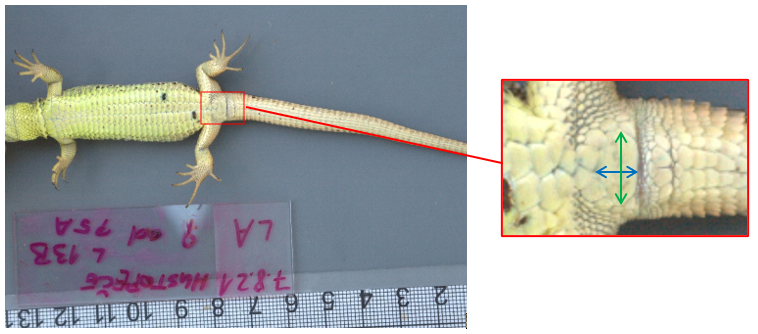
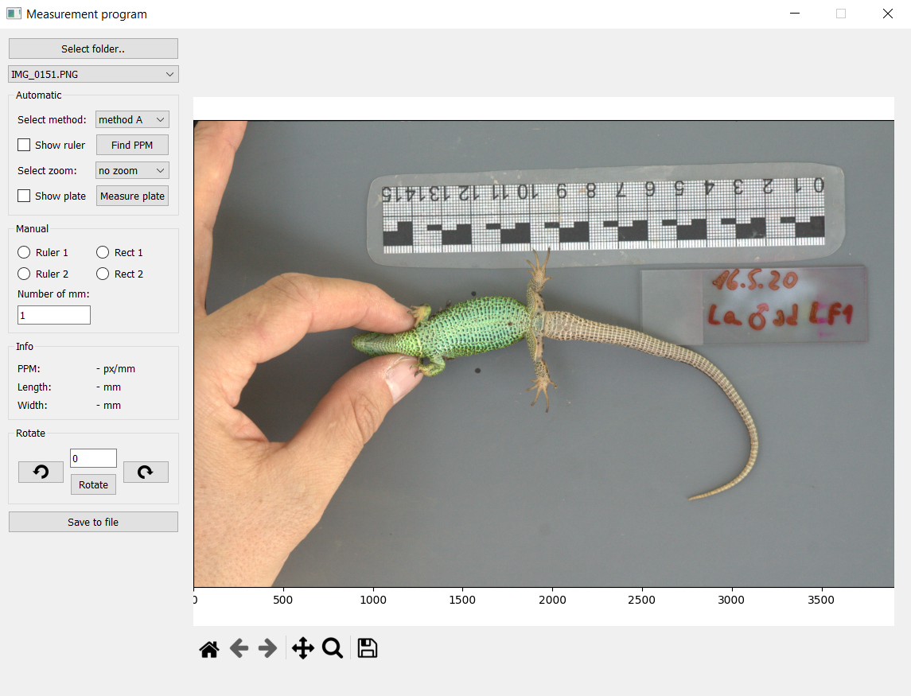

<b><h2>Master's Thesis</h2></b>

<b>Bezkontaktní měření rozměrů determinačních šupin</b>

<b>Non–contact measurement of the dimensions of determination scales</b>

 <b>Abstrakt:</b> Tato práce se zabývá bezkontaktním měřením rozměrů análního štítku ještěrky obecné. V práci jsou nejprve stručně shrnuty techniky využívané k měření rozměrů objektů a techniky využívané k segmentaci obrazu. Následně práce poskytuje základní shrnutí o neuronových sítích a konvolučních neuronových sítích. V praktické části je popsán systém pro měření rozměrů análního štítku ještěrky obecné. Navržené algoritmy jsou implementovány v grafickém uživatelském rozhraní umožňující automatické i ruční měření.

 <b>Klíčová slova:</b> umělá inteligence, konvoluční neuronové sítě, detekce objektů, bezkontaktní měření rozměrů, počítačové vidění, segmentace obrazu, Python, TensorFlow 

 <b>Abstract:</b> This thesis deals with non-contact measuring the dimensions of the sand lizard anal plate. First the thesis briefly summarizes the techniques used to measure object dimensions and the techniques used for image segmentation. Subsequently, the thesis provides a basic overview of neural networks and convolutional neural networks. The practical part describes a system for measuring the dimensions of the sand lizard anal plate. The proposed algorithms are implemented in a graphical user interface enabling automatic and manual measurements.

 <b>Keywords:</b> artificial intelligence, convolutional neural networks, object detection, non-contact dimensional measurement, computer vision, image segmentation, Python, TensorFlow 

## About:
This work was made in collaboration with scientists from Masaryk University and the Czech Academy of Sciences.

One of the most widespread species of lizards in the Czech Republic is the sand lizard, which is manifested by the fact that its colour changes during its life depending on its age and sex. In addition, there is asymmetry in the growth of various body parts, including scales. The young of this lizard grow at a similar rate and size regardless of its sex. However, from a certain year of its life, the growth development changes. The males start to grow their heads, limbs and tail much faster. Females, on the other hand, invest more energy in growing their body length between limbs to increase the capacity of the body cavity for future egg production. This characteristic is called allometry of growth. The differential growth of different body parts during its life should also concern to the scales. Specifically, scientists expect that the size of the scales should change during its lifetime, but their shape should remain the same. The anal plate has been chosen as the most appropriate determinant scale to confirm or refute this assumption. Index of the anal plate determines the level of elongation of this scale in the transverse direction and can be calculated as the ratio of the width and length and these two distances are important to measure as accurately as possible.

 <b>Practical part:</b>
The designed and implemented system consists of four main parts. First, regions of interest are detected using trained convolutional neural network models. Then, the scale of the image is detected using computer vision algorithms. The detected anal plate is segmented into binary form using the trained convolutional neural network models and its dimensions are measured using the detected scale. 
 

## Images

<b>Dimensions of the anal plate of the sand lizard</b>

<b>Simple GUI made in PyQt</b>

## Citation
ŠEMORA, Petr.  _Bezkontaktní měření rozměrů determinačních šupin._ [online]. Brno, 2022. Diplomová práce. Vysoké učení technické v Brně, Fakulta strojního inženýrství, Ústav automatizace a informatiky. Vedoucí diplomové práce: Ing. Pavel Škrabánek, Ph.D. Dostupné z: https://www.vut.cz/studenti/zav-prace/detail/139431.
